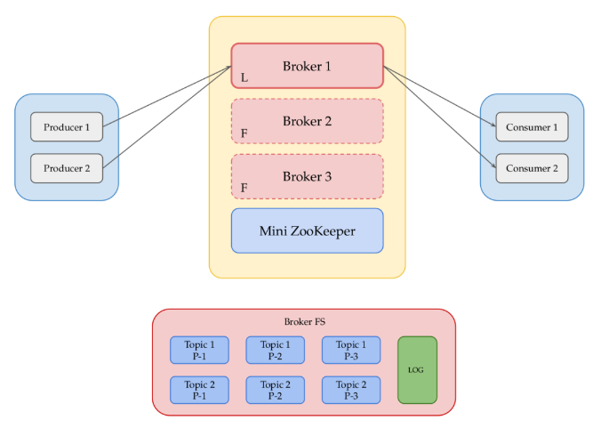

# Python Implementation of a Mini Kafka
## Introduction
This is a mini kafka implementation in python with a _CLI_ interface. It is a simplified version of the kafka messaging system. It supports multiple publishers and consumers and follows a PubSub model. \
It supports the following features:
- Multiple topics
- Mini Zookeeper
- Fault tolerance
- Replication
- Leader election

## Architecture

### Mini Zookeeper
The mini zookeeper is a simplified version of the zookeeper. It is used to maintain the metadata of the kafka cluster. 
It is assumed that the zookeeper is always up and running. \
It is responsible for the following:
- Monitoring broker health (heartbeats).
- Keeping track of leader for each partition.
- Leader election (Round Robin).

### Broker
The broker is the main component of the kafka cluster. \
It is responsible for the following:
- Creating and managing topics.
- Registering with the zookeeper.
- Registering Producers and Consumers.
- Storing messages in partitions.
    - Stored in files.
    - Create partitions for each topic.
    - Replicate partitions.
- Leader is responsible for publish operations. Consumers can read from any broker.

### Producer
The producer is responsible for publishing messages to a kafka topic. \
It is responsible for the following:
- Register to a kafka topic or notifing the broker to create a new topic.
- Coordinating with the broker to keep track of all the messages the broker has received (Ack).

### Consumer
The consumer is responsible for consuming messages from a kafka topic. \
It is responsible for the following:
- Register to a kafka topic or notifing the broker to create a new topic.
- Receive all messages from the time of creation of a topic using `--from-beginning` flag.
- Coordinating with the broker to keep track of all the messages the consumer has received (Ack).

## Technologies
- Python 3.11
- Asynchronous socket programming (asyncio)
- Redis

